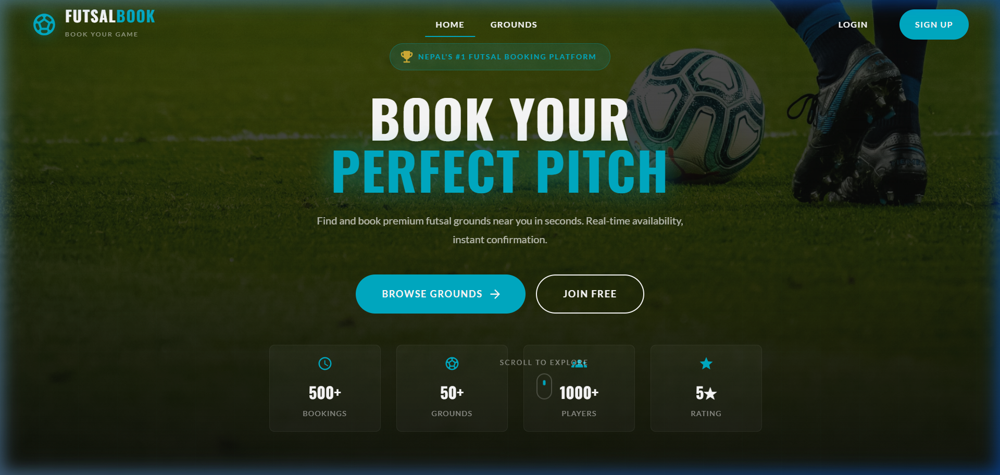
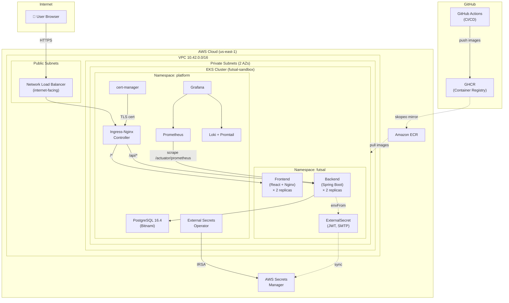
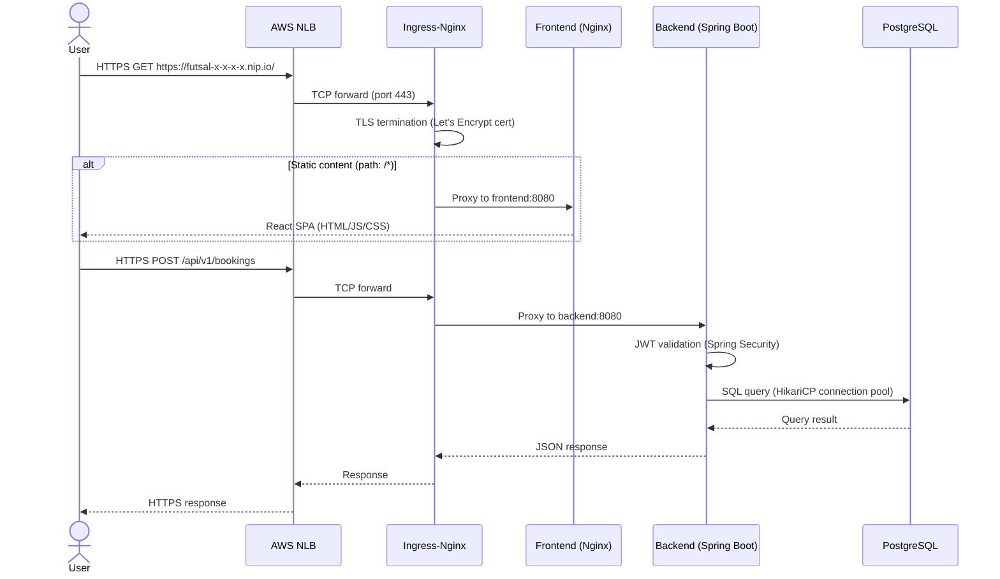
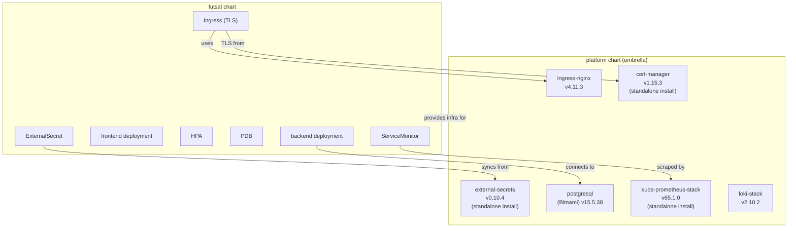

# System Architecture

> High-level architecture of the Futsal Arena deployed on AWS EKS with production-grade infrastructure patterns.

**Live Deployment**: [https://futsal-32-193-89-70.nip.io](https://futsal-32-193-89-70.nip.io)

---

## Architecture Overview

The Futsal Arena is a full-stack web application that enables users to discover, book, and manage futsal court reservations. It is deployed as a cloud-native microservice on Amazon EKS with a fully automated infrastructure pipeline.

---

## Namespace Strategy

The deployment is split into two Kubernetes namespaces with clear separation of concerns:

```mermaid
flowchart LR
    subgraph platform["📦 platform namespace"]
        direction TB
        P1["Ingress-Nginx Controller"]
        P2["cert-manager"]
        P3["External Secrets Operator"]
        P4["PostgreSQL 16.4"]
        P5["Prometheus"]
        P6["Grafana"]
        P7["Loki + Promtail"]
        P8["Alertmanager"]
        P9["ClusterSecretStore"]
        P10["ClusterIssuer<br>(Let's Encrypt)"]
    end

    subgraph futsal["📦 futsal namespace"]
        direction TB
        F1["Backend Deployment (×2)"]
        F2["Frontend Deployment (×2)"]
        F3["Ingress (TLS)"]
        F4["HPA (auto-scale 2→4)"]
        F5["PDB (minAvailable: 1)"]
        F6["ServiceMonitor"]
        F7["ExternalSecrets<br>(JWT, SMTP, DB)"]
        F8["Uploads PVC (2Gi)"]
    end

    platform -.->|"DB connection<br>Secret sync<br>TLS issuance<br>Metrics scrape"| futsal
```

| Namespace | Purpose | Managed By |
|-----------|---------|------------|
| `platform` | Shared infrastructure: ingress, database, certificates, secrets, monitoring | `platform` Helm chart |
| `futsal` | Application workloads: backend, frontend, ingress rules, autoscaling | `futsal` Helm chart |

**Why this separation?**
- Infrastructure can be upgraded independently of the application
- RBAC policies can restrict application teams to the `futsal` namespace
- Secrets are scoped per namespace with explicit cross-namespace `ExternalSecret` definitions
- Monitoring components can observe all namespaces without being affected by app deployments

---

## Request Flow

The following sequence diagram shows how a typical API request travels through the system:

### Routing Rules

| Path | Target | Service Port | Description |
|------|--------|-------------|-------------|
| `/api/*` | Backend | 8080 | REST API endpoints |
| `/actuator/*` | Backend | 8080 | Health checks and metrics |
| `/*` | Frontend | 8080 | React SPA (catch-all) |

---

## Component Details

### Backend (Spring Boot)

- **Replicas**: 2 (min), scales to 4 via HPA at 70% CPU
- **Resources**: 500m–1000m CPU, 1Gi–2Gi memory
- **Health probes**: Liveness (`/actuator/health/liveness`), Readiness (`/actuator/health/readiness`)
- **Deployment strategy**: RollingUpdate with `maxSurge: 1`, `maxUnavailable: 0` (zero-downtime)
- **Topology**: `topologySpreadConstraints` distribute pods across nodes
- **Security**: Non-root (UID 1000), seccomp RuntimeDefault, drop ALL capabilities
- **Secrets**: Injected via `envFrom` from two Kubernetes secrets (`futsal-backend-db`, `futsal-backend-app`)
- **Persistent storage**: 2Gi EBS volume mounted at `/var/app/uploads`

### Frontend (React + Nginx)

- **Replicas**: 2 (fixed)
- **Resources**: 50m–200m CPU, 64Mi–128Mi memory
- **Container**: Read-only root filesystem with emptyDir mounts for Nginx temp dirs
- **Security**: Non-root (UID 101, nginx user), seccomp RuntimeDefault
- **Deployment strategy**: Same zero-downtime rolling update pattern

### PostgreSQL

- **Deployment**: Bitnami Helm chart (StatefulSet) in `platform` namespace
- **Storage**: 8Gi EBS gp2 persistent volume
- **Credentials**: Managed by External Secrets Operator from AWS Secrets Manager
- **Access**: Backend connects via Kubernetes DNS (`platform-postgresql.platform.svc.cluster.local`)

---

## High Availability Design

| Mechanism | Component | Configuration |
|-----------|-----------|---------------|
| **Horizontal Pod Autoscaler** | Backend | Min 2 → Max 4 replicas, target 70% CPU |
| **Pod Disruption Budget** | Backend | `minAvailable: 1` during voluntary disruptions |
| **Topology Spread** | Backend, Frontend | `maxSkew: 1` across nodes |
| **Rolling Updates** | All deployments | `maxSurge: 1, maxUnavailable: 0` |
| **Multi-AZ** | EKS nodes | Worker nodes across 2 availability zones |
| **Persistent Volumes** | PostgreSQL, Alertmanager | EBS gp2 with data durability |

---

## Helm Chart Dependency Graph

> **Note**: cert-manager, external-secrets, and kube-prometheus-stack are installed as **standalone Helm releases** (not as subcharts) to avoid CRD lifecycle issues. Their subchart entries in the platform chart are disabled (`enabled: false`) and only their custom resources (ClusterIssuer, ClusterSecretStore, ExternalSecrets) are managed by the platform chart.
