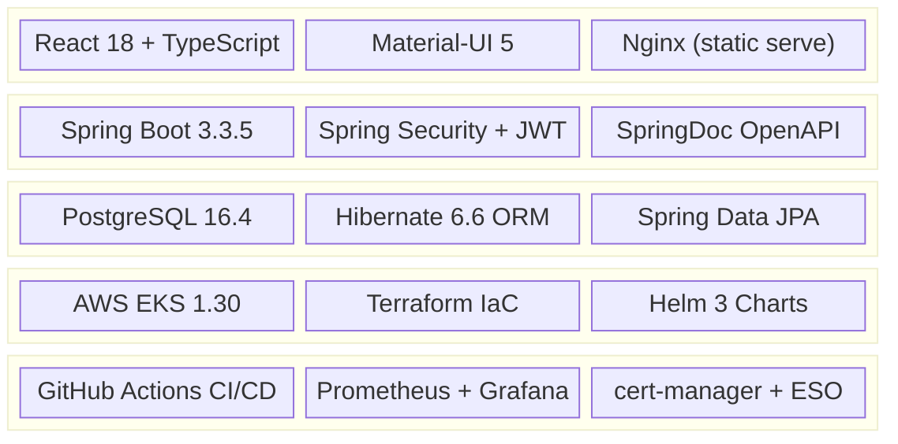

# Technical Stack

> A comprehensive breakdown of every technology used in the Futsal Arena, from application code to cloud infrastructure.

---

## Stack at a Glance



---

## Backend

| Component | Technology | Version | Purpose |
|-----------|-----------|---------|---------|
| Framework | Spring Boot | 3.3.5 | Application framework with embedded Tomcat |
| Language | Java | 17 (LTS) | Temurin distribution for container builds |
| Security | Spring Security | 6.x | Authentication and authorization framework |
| Auth Tokens | JJWT | 0.11.5 | JWT creation, signing, and validation |
| ORM | Hibernate | 6.6.2 | Object-relational mapping with DDL auto-update |
| Data Access | Spring Data JPA | 3.x | Repository abstraction over Hibernate |
| Validation | Spring Validation | 3.x | Bean validation with Jakarta annotations |
| API Docs | SpringDoc OpenAPI | 2.6.0 | Swagger UI at `/swagger-ui.html` |
| Metrics | Micrometer + Prometheus | 1.x | Exports metrics at `/actuator/prometheus` |
| Health | Spring Actuator | 3.x | Liveness and readiness probes |
| Email | Spring Mail | 3.x | Optional SMTP integration for notifications |
| Utilities | Lombok | 1.18.36 | Boilerplate reduction via annotations |
| Serialization | Jackson JSR310 | 2.x | Java 8 date/time type support |

### Backend Architecture

The backend follows a layered architecture pattern:

```
api/            → REST controllers (12 controllers)
service/        → Business logic layer
repository/     → Spring Data JPA repositories
entity/         → JPA entity classes (9 entities)
dto/            → Data transfer objects
config/         → Spring configuration classes
exception/      → Custom exception handlers
validation/     → Custom validators
converter/      → Type converters
```

### Domain Entities

| Entity | Description |
|--------|-------------|
| `User` | Player and ground owner accounts with role-based access |
| `FutsalCompany` | Futsal venue operator profiles |
| `FutsalGround` | Individual courts within a company |
| `TimeSlot` | Available time slots for grounds |
| `Booking` | Reservations linking users to time slots |
| `Payment` | Payment records for bookings |
| `Review` | User reviews and ratings for grounds |
| `Report` | Issue reports and feedback |
| `OpenMatch` | Public match listings for player matchmaking |

---

## Frontend

| Component | Technology | Version | Purpose |
|-----------|-----------|---------|---------|
| Framework | React | 18.2 | Component-based UI library |
| Language | TypeScript | 4.9 | Type-safe JavaScript development |
| UI Library | Material-UI (MUI) | 5.15 | Pre-built accessible components |
| Icons | MUI Icons | 5.15 | Material Design icon set |
| Date Picker | MUI X Date Pickers | 7.1 | Date/time selection components |
| Routing | React Router DOM | 6.22 | Client-side navigation |
| HTTP Client | Axios | 1.6 | API calls with interceptors |
| Charts | Recharts | 3.7 | Revenue and analytics visualizations |
| Date Utils | Day.js | 1.11 | Lightweight date manipulation |
| Build Tool | react-scripts (CRA) | 5.0 | Webpack-based build pipeline |
| Runtime | Node.js | 20 (LTS) | Build environment |

### Frontend Component Structure

```
components/
├── admin/          → Admin dashboard panels and analytics
├── auth/           → Login, registration forms
├── booking/        → Booking flow components
├── dashboard/      → User dashboard widgets
├── feedback/       → Review and report forms
├── grounds/        → Ground listing and detail views
├── layout/         → Header, footer, navigation
├── matches/        → Open match listings
├── payment/        → Payment processing views
└── reviews/        → Review display components

pages/
├── Home.tsx        → Landing page
└── OpenMatchesPage.tsx → Public match browser
```

---

## Database

| Component | Technology | Version | Details |
|-----------|-----------|---------|---------|
| Engine | PostgreSQL | 16.4 | Deployed via Bitnami Helm chart |
| Persistence | EBS gp2 | 8Gi | Persistent volume for data durability |
| DDL Strategy | Hibernate auto-update | — | Schema migration on application start |
| Connection Pool | HikariCP | Default | High-performance JDBC connection pool |

### Database Connection

The backend connects to PostgreSQL via a cross-namespace Kubernetes DNS name:

```
jdbc:postgresql://platform-postgresql.platform.svc.cluster.local:5432/futsal_booking
```

Credentials are injected from Kubernetes secrets (sourced from AWS Secrets Manager via External Secrets Operator).

---

## Containerization

### Backend Dockerfile (Multi-Stage)

| Stage | Base Image | Purpose |
|-------|-----------|---------|
| **Build** | `maven:3.9.9-eclipse-temurin-17` | Compile source and package JAR |
| **Runtime** | `eclipse-temurin:17-jre-alpine` | Minimal JRE runtime (~95% smaller) |

Key optimizations:
- **Dependency caching**: `dependency:go-offline` runs before `COPY src`, enabling Docker layer caching
- **Non-root user**: Application runs as `app:app` (UID 1000)
- **JVM container awareness**: `-XX:+UseContainerSupport -XX:MaxRAMPercentage=75.0` respects cgroup memory limits

### Frontend Container

- **Nginx-based** static file server on port 8080
- **Read-only root filesystem** with tmpfs mounts for cache/run/tmp
- Runs as UID 101 (nginx user)

---

## Kubernetes & Orchestration

| Component | Technology | Version | Purpose |
|-----------|-----------|---------|---------|
| Cluster | Amazon EKS | 1.30 | Managed Kubernetes control plane |
| Package Manager | Helm | 3.x | Kubernetes application packaging |
| Ingress | ingress-nginx | 4.11.3 | HTTP/HTTPS routing and TLS termination |
| TLS | cert-manager | 1.20.2 | Automated Let's Encrypt certificates |
| Secrets | External Secrets Operator | 0.10.4 | AWS Secrets Manager → K8s Secrets sync |
| Monitoring | kube-prometheus-stack | 84.3.0 | Prometheus + Grafana + Alertmanager |
| Logging | Loki Stack | 2.10.2 | Log aggregation with Promtail |

### Helm Chart Strategy

The project uses a **two-chart architecture**:

| Chart | Namespace | Contents |
|-------|-----------|----------|
| `platform` | `platform` | Ingress-Nginx, cert-manager CRs, ESO CRs, PostgreSQL, Loki |
| `futsal` | `futsal` | Backend deployment, Frontend deployment, Ingress, HPA, PDB, ServiceMonitor |

---

## Infrastructure as Code

| Component | Technology | Version | Purpose |
|-----------|-----------|---------|---------|
| IaC Tool | Terraform | 1.x | Declarative AWS infrastructure provisioning |
| VPC Module | `terraform-aws-modules/vpc/aws` | ~5.13 | VPC, subnets, NAT gateway |
| EKS Module | `terraform-aws-modules/eks/aws` | ~20.24 | EKS cluster, node groups, addons |
| State | `terraform.tfstate` (local) | — | Infrastructure state tracking |

### Terraform Resources

```
deploy/terraform/
├── main.tf          → Provider config, availability zones, locals
├── vpc.tf           → VPC with public/private subnets across 2 AZs
├── eks.tf           → EKS cluster with managed node group
├── ecr.tf           → ECR repositories with lifecycle policies
├── secrets.tf       → AWS Secrets Manager secrets (DB, JWT, SMTP, Grafana)
├── iam.tf           → IRSA role and policy for External Secrets
├── variables.tf     → Configurable parameters
├── outputs.tf       → Values consumed by bootstrap.sh
└── versions.tf      → Provider version constraints
```

---

## CI/CD

| Component | Technology | Purpose |
|-----------|-----------|---------|
| CI Platform | GitHub Actions | Automated test and build pipeline |
| Container Registry | GHCR (GitHub Container Registry) | Primary image storage |
| Image Mirroring | Skopeo | GHCR → ECR cross-registry copy |
| Security Scanning | Trivy (Aqua Security) | Container vulnerability scanning |
| Scan Reporting | GitHub Code Scanning (SARIF) | Vulnerability dashboard in GitHub |

---

## Testing

| Component | Technology | Purpose |
|-----------|-----------|---------|
| Unit Testing | JUnit 5 | Java test framework |
| Integration Testing | Spring Boot Test | Application context testing |
| Security Testing | Spring Security Test | Authentication/authorization tests |
| Test Database | H2 (in-memory) | Isolated test environment |
| API Testing | Postman Collection | Manual/automated API validation |

---

## Version Summary

```
Java                    17 (LTS)
Spring Boot             3.3.5
React                   18.2
TypeScript              4.9
PostgreSQL              16.4
Kubernetes (EKS)        1.30
Terraform               1.x
Helm                    3.x
Node.js                 20 (LTS)
```
