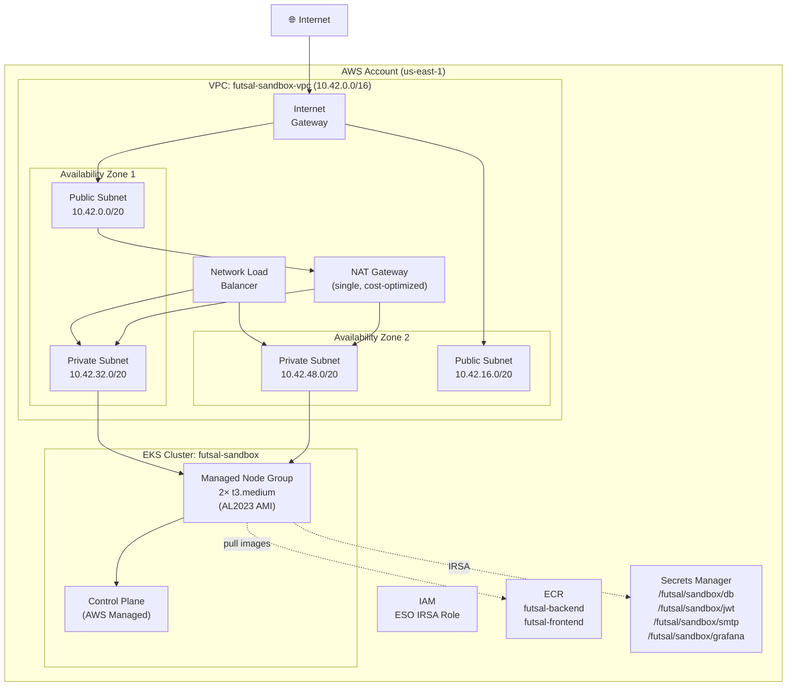
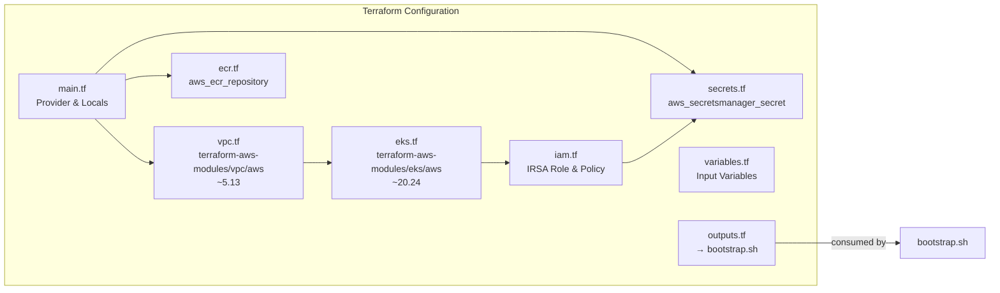
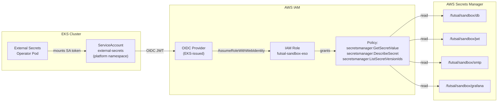

# Cloud Infrastructure

> AWS infrastructure provisioned with Terraform for the Futsal Arena sandbox environment.

---

## Infrastructure Overview

All AWS resources are provisioned declaratively using Terraform with community modules. The infrastructure follows a single-region, multi-AZ design optimized for a sandbox/demo environment with clear upgrade paths to production.



---

## Terraform Module Map



---

## VPC Architecture

The VPC is built using the official `terraform-aws-modules/vpc/aws` module:

| Parameter | Value | Rationale |
|-----------|-------|-----------|
| CIDR | `10.42.0.0/16` | 65,536 IPs — room for growth |
| Availability Zones | 2 | Multi-AZ for HA at minimum cost |
| Public Subnets | `10.42.0.0/20`, `10.42.16.0/20` | NAT gateway, NLB placement |
| Private Subnets | `10.42.32.0/20`, `10.42.48.0/20` | EKS worker nodes (no direct internet) |
| NAT Gateway | Single | Cost optimization for sandbox (1 NAT vs 2) |
| DNS Hostnames | Enabled | Required for EKS service discovery |

### Subnet Tagging

Subnets are tagged for Kubernetes service discovery:

```hcl
# Public subnets — for internet-facing load balancers
public_subnet_tags = {
  "kubernetes.io/role/elb" = "1"
}

# Private subnets — for internal load balancers
private_subnet_tags = {
  "kubernetes.io/role/internal-elb" = "1"
}
```

---

## EKS Cluster

| Parameter | Value | Details |
|-----------|-------|---------|
| Cluster Name | `futsal-sandbox` | Used across all resource naming |
| Kubernetes Version | 1.30 | Current stable EKS version |
| Endpoint Access | Public (`0.0.0.0/0`) | Sandbox only — would restrict to VPN CIDR in production |
| Node Group | `default` | Single managed node group |
| Instance Type | `t3.medium` (2 vCPU, 4Gi) | Balanced for web workloads |
| AMI | AL2023 x86_64 Standard | Amazon Linux 2023 optimized for EKS |
| Node Count | 2 (desired) / 3 (max) | Multi-AZ for pod distribution |
| Admin Access | Cluster creator | `enable_cluster_creator_admin_permissions = true` |

### EKS Managed Addons

| Addon | Purpose |
|-------|---------|
| `coredns` | Cluster DNS resolution |
| `kube-proxy` | Network proxy on each node |
| `vpc-cni` | AWS VPC CNI for pod networking (each pod gets a VPC IP) |
| `aws-ebs-csi-driver` | Persistent volume provisioning via EBS |

### Node IAM Policies

```
AmazonEC2ContainerRegistryReadOnly  → Pull images from ECR
AmazonEBSCSIDriverPolicy            → Create/attach EBS volumes for PVCs
```

---

## ECR (Elastic Container Registry)

Two repositories store the application container images:

| Repository | Image Tag Strategy | Mutability |
|------------|-------------------|------------|
| `futsal-backend` | Git SHA + `latest` | **Immutable** |
| `futsal-frontend` | Git SHA + `latest` | **Immutable** |

### Security Features

- **Scan on push**: Automatic vulnerability scanning for every pushed image
- **Encryption**: AES-256 at rest (AWS-managed key)
- **Lifecycle policy**: Keep only the 10 most recent images (auto-cleanup)

```hcl
image_tag_mutability = "IMMUTABLE"   # Prevent tag overwriting
force_delete         = true          # Allow cleanup in sandbox

image_scanning_configuration {
  scan_on_push = true                # Auto vulnerability scan
}
```

---

## AWS Secrets Manager

Four secrets are pre-created by Terraform and populated by `bootstrap.sh` with randomly generated values:

| Secret Path | Contents | Consumer |
|-------------|----------|----------|
| `/futsal/sandbox/db` | `{username, password}` | PostgreSQL + Backend |
| `/futsal/sandbox/jwt` | `{secret}` | Backend JWT signing |
| `/futsal/sandbox/smtp` | `{host, port, username, password}` | Backend email (optional) |
| `/futsal/sandbox/grafana` | `{username, password}` | Grafana admin login |

Secrets are synced to Kubernetes via the External Secrets Operator (see [Security Architecture](06-security.md)).

```hcl
# All secrets have recovery_window_in_days = 0 for sandbox
# (allows immediate deletion without 7-day retention)
```

---

## IAM & IRSA (IAM Roles for Service Accounts)

IRSA allows Kubernetes pods to assume AWS IAM roles without static credentials.



### Trust Policy

The IAM role trust is scoped to a **specific service account** in a **specific namespace**:

```hcl
condition {
  test     = "StringEquals"
  variable = "${oidc_provider}:sub"
  values   = ["system:serviceaccount:platform:external-secrets"]
}
```

This means **only** the `external-secrets` service account in the `platform` namespace can assume this role — no other pod in the cluster can access Secrets Manager.

### Permissions (Least Privilege)

The policy grants read-only access to **only the 4 specific secrets** required:

```hcl
actions = [
  "secretsmanager:GetSecretValue",
  "secretsmanager:DescribeSecret",
  "secretsmanager:ListSecretVersionIds"
]
resources = [
  aws_secretsmanager_secret.db.arn,
  aws_secretsmanager_secret.jwt.arn,
  aws_secretsmanager_secret.smtp.arn,
  aws_secretsmanager_secret.grafana.arn,
]
```

---

## Resource Tagging Strategy

All Terraform-managed resources receive consistent tags via the AWS provider's `default_tags`:

```hcl
default_tags {
  tags = {
    Project     = "futsal_arena"
    Environment = "sandbox"
    ManagedBy   = "terraform"
    Owner       = "amt"
  }
}
```

These tags enable:
- **Cost allocation**: Filter AWS billing by project/environment
- **Resource identification**: Distinguish Terraform-managed from manually created resources
- **Compliance**: Prove infrastructure ownership and management method

---

## Terraform Variables

| Variable | Default | Description |
|----------|---------|-------------|
| `region` | `us-east-1` | AWS deployment region |
| `cluster_version` | `1.30` | EKS Kubernetes version |
| `node_instance_type` | `t3.medium` | EC2 instance type for worker nodes |
| `node_desired_size` | `2` | Number of worker nodes |
| `owner_tag` | `amt` | Owner tag for resource tracking |
| `letsencrypt_email` | *(required)* | Email for Let's Encrypt certificate registration |

---

## Terraform Outputs → Bootstrap Script

Terraform outputs are consumed by `bootstrap.sh` to configure Helm and Kubernetes:

| Output | Used For |
|--------|----------|
| `region` | AWS region for ECR login and kubeconfig |
| `cluster_name` | `aws eks update-kubeconfig` target |
| `ecr_registry` | Skopeo login target |
| `ecr_backend_url` / `ecr_frontend_url` | Image push and Helm `--set` targets |
| `eso_role_arn` | External Secrets ServiceAccount annotation |
| `secret_arn_*` | `aws secretsmanager put-secret-value` targets |

---

## Production Upgrade Path

| Sandbox Configuration | Production Recommendation |
|-----------------------|--------------------------|
| Single NAT Gateway | NAT Gateway per AZ for HA |
| Public API endpoint `0.0.0.0/0` | Restrict to VPN/office CIDR blocks |
| `t3.medium` nodes | `m5.large` or larger based on load testing |
| 2 worker nodes | 3+ nodes across 3 AZs |
| Local Terraform state | Remote state in S3 + DynamoDB locking |
| `recovery_window_in_days = 0` | 7+ days for accidental deletion protection |
| `force_delete = true` on ECR | Remove for image protection |
