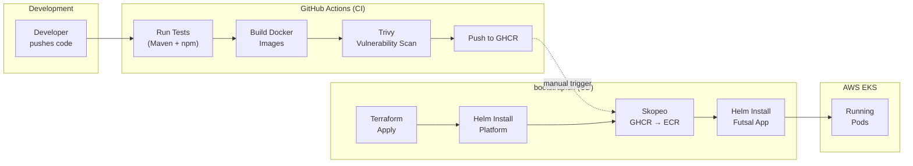
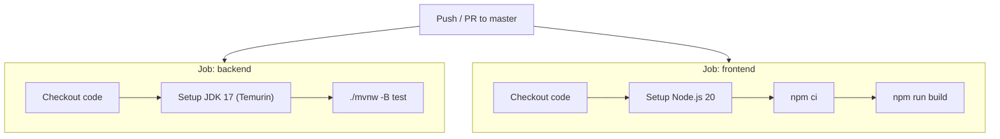
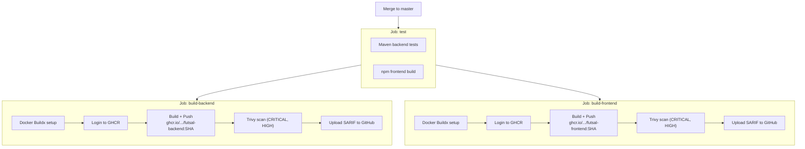

# CI/CD Pipeline

> Automated build, test, scan, and deployment pipeline from GitHub to AWS EKS.

---

## Pipeline Overview

The Futsal Arena uses a two-phase delivery model:

1. **CI (Continuous Integration)** — GitHub Actions automatically tests, builds, scans, and pushes container images on every merge to `master`
2. **CD (Continuous Deployment)** — The `bootstrap.sh` script orchestrates the full infrastructure and application deployment to EKS



---

## CI Pipeline: GitHub Actions

### Workflow 1: `ci.yml` — Pull Request Gates

Runs on every push and PR to `master`. This is the fast-feedback loop.



| Job | Steps | Duration | Purpose |
|-----|-------|----------|---------|
| `backend` | JDK 17 → Maven test (H2 in-memory DB) | ~2 min | Unit + integration tests |
| `frontend` | Node 20 → npm ci → npm run build | ~1 min | TypeScript compilation + build validation |

Both jobs run in **parallel** for faster feedback.

---

### Workflow 2: `image-build.yml` — Build, Scan & Push

Runs on every merge to `master` (skips on PRs). This is the full image pipeline.



### Image Tagging Strategy

Each image is pushed with two tags:

| Tag | Example | Purpose |
|-----|---------|---------|
| Git SHA | `ghcr.io/amritmalla/futsal-backend:a1b2c3d4...` | Immutable, traceable to exact commit |
| `latest` | `ghcr.io/amritmalla/futsal-backend:latest` | Convenience for local development |

The SHA tag is used in production deployments for guaranteed reproducibility.

### Security Scanning

Trivy scans each image for vulnerabilities:

```yaml
- name: Trivy scan
  uses: aquasecurity/trivy-action@master
  with:
    image-ref: ${{ env.BACKEND_IMAGE }}:${{ github.sha }}
    format: sarif
    output: trivy-backend.sarif
    exit-code: '0'            # Non-blocking (advisory mode)
    severity: CRITICAL,HIGH   # Only critical/high CVEs

- name: Upload Trivy SARIF
  uses: github/codeql-action/upload-sarif@v3
  with:
    sarif_file: trivy-backend.sarif
    category: trivy-backend   # Shows in GitHub Security tab
```

### Docker Build Optimizations

| Feature | Configuration | Benefit |
|---------|--------------|---------|
| BuildKit | `docker/setup-buildx-action@v3` | Parallel build stages |
| Layer caching | `cache-from: type=gha` / `cache-to: type=gha,mode=max` | Faster rebuilds via GitHub Actions cache |
| Multi-platform | `platforms: linux/amd64` | Explicit architecture targeting |
| Build args | `REACT_APP_API_BASE_URL=/api/v1` | Frontend API endpoint baked at build time |

### Required Permissions

```yaml
permissions:
  contents: read         # Checkout code
  packages: write        # Push to GHCR
  security-events: write # Upload Trivy SARIF results
```

---

## CD Pipeline: `bootstrap.sh`

The deployment script is a single, idempotent Bash script that takes a cluster from zero to fully running in approximately 15 minutes.

### Bootstrap Flow

```mermaid
flowchart TD
    Start["bootstrap.sh<br>(requires: GHCR_USER env)"] --> Precheck

    subgraph Phase1["Phase 1: Infrastructure"]
        Precheck["Precheck<br>(verify tools + GHCR images)"]
        TF["Terraform Apply<br>(VPC, EKS, ECR, Secrets, IAM)"]
        Kubeconfig["Update kubeconfig"]
        WriteSecrets["Generate & write secrets<br>to AWS Secrets Manager"]
    end

    subgraph Phase2["Phase 2: Platform Services"]
        HelmDeps["Helm dependency build"]
        PlatformBase["Helm install platform<br>(Nginx, PostgreSQL, Loki)<br>cert-manager=false, ESO=false"]
        CertMgr["Install cert-manager<br>(standalone release)"]
        ESO["Install external-secrets<br>(standalone release)"]
        WaitCRDs["Wait for CRDs<br>(ClusterIssuer, ExternalSecret)"]
        WaitCtrl["Wait for controllers<br>(deployment Available)"]
    end

    subgraph Phase3["Phase 3: Custom Resources"]
        PlatformCRs["Helm upgrade platform<br>(createCustomResources=true)"]
        WaitGrafana["Wait for grafana-admin secret"]
        InstallKPS["Install kube-prometheus-stack<br>(standalone release)"]
    end

    subgraph Phase4["Phase 4: Application"]
        WaitNLB["Wait for NLB hostname"]
        ResolveIP["Resolve NLB → IPv4"]
        GenHost["Generate nip.io hostname"]
        Mirror["Skopeo mirror<br>GHCR → ECR"]
        HelmApp["Helm install futsal app"]
        WaitCert["Wait for TLS certificate"]
        WaitBackend["Wait for backend readiness"]
    end

    Precheck --> TF --> Kubeconfig --> WriteSecrets
    WriteSecrets --> HelmDeps --> PlatformBase
    PlatformBase --> CertMgr --> ESO --> WaitCRDs --> WaitCtrl
    WaitCtrl --> PlatformCRs --> WaitGrafana --> InstallKPS
    InstallKPS --> WaitNLB --> ResolveIP --> GenHost --> Mirror
    Mirror --> HelmApp --> WaitCert --> WaitBackend

    WaitBackend --> Done["✅ bootstrap done<br>URL: https://futsal-x-x-x-x.nip.io"]
```



### Bootstrap Stages Detail

| Stage | Duration | What Happens |
|-------|----------|-------------|
| Precheck | ~5s | Verify `aws`, `terraform`, `kubectl`, `helm`, `skopeo`, `jq`, `gh` are installed. Verify GHCR images exist. |
| Terraform Apply | ~8 min | Create VPC, EKS, ECR, Secrets Manager, IAM role. First run takes longest. |
| Write Secrets | ~5s | Generate random passwords with `openssl rand`, write JSON to Secrets Manager. |
| Platform (base) | ~3 min | Install Nginx ingress controller, PostgreSQL, Loki. CRDs-dependent subcharts disabled. |
| cert-manager | ~1 min | Standalone Helm release with `crds.enabled=true`. |
| external-secrets | ~1 min | Standalone Helm release with IRSA annotation. |
| Wait for CRDs | ~30s | Poll until `ClusterIssuer` and `ExternalSecret` CRDs are registered. |
| Platform CRs | ~30s | Create `ClusterIssuer`, `ClusterSecretStore`, `ExternalSecret` resources. |
| kube-prometheus-stack | ~2 min | Prometheus, Grafana, Alertmanager with persistent storage. |
| Image Mirror | ~2 min | Copy backend + frontend images from GHCR to ECR via Skopeo. |
| Futsal App | ~2 min | Deploy backend (2 replicas), frontend (2 replicas), Ingress, HPA, PDB. |
| Certificate | ~1 min | Wait for Let's Encrypt to issue TLS certificate. |

### Why Standalone Installs?

cert-manager, external-secrets, and kube-prometheus-stack are installed as **separate Helm releases** rather than subcharts because:

1. **CRD ordering** — CRDs must exist before custom resources can be created. Subcharts install simultaneously, causing race conditions.
2. **Upgrade independence** — Each operator can be upgraded without touching the platform chart.
3. **Failure isolation** — A failed monitoring stack upgrade won't roll back the ingress controller.

### Precheck Script

Before any deployment begins, `precheck.sh` validates the environment:

```bash
# Required tools
require_cmd aws terraform kubectl helm skopeo jq gh

# AWS authentication
aws sts get-caller-identity

# GHCR images exist for current commit
docker manifest inspect "ghcr.io/${GHCR_USER}/futsal-backend:${SHA}"
```

---

## Image Mirroring: GHCR → ECR

Images are built and pushed to GHCR in CI, then mirrored to ECR during deployment:

```
GHCR (source of truth)              ECR (EKS runtime)
ghcr.io/amritmalla/futsal-backend   970597968483.dkr.ecr.us-east-1.amazonaws.com/futsal-backend
ghcr.io/amritmalla/futsal-frontend  970597968483.dkr.ecr.us-east-1.amazonaws.com/futsal-frontend
```

**Why mirror instead of pushing directly to ECR?**
- GHCR uses GitHub token auth (no AWS credentials needed in CI)
- ECR provides faster pulls from within the VPC (same-region, no internet egress)
- GHCR serves as a registry-agnostic backup

The mirror uses `skopeo copy` with inline credentials to avoid Docker Desktop dependencies:

```bash
PASSWORD="$(aws ecr get-login-password --region "$REGION")"
skopeo copy --all --dest-creds "AWS:$PASSWORD" \
  "docker://ghcr.io/${GHCR_USER}/futsal-backend:${SHA}" \
  "docker://${ECR_BACKEND}:${SHA}"
```
