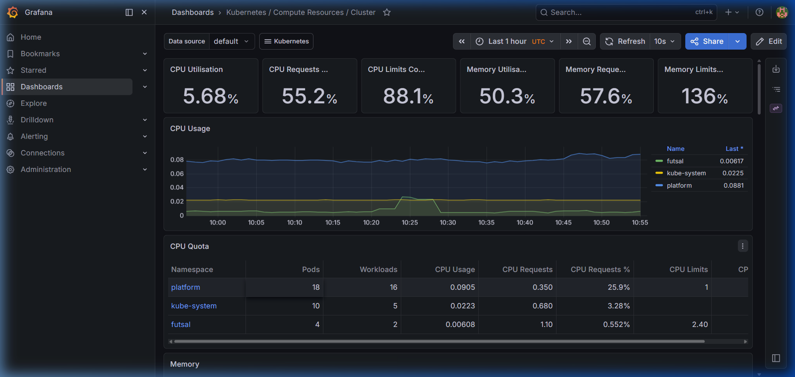
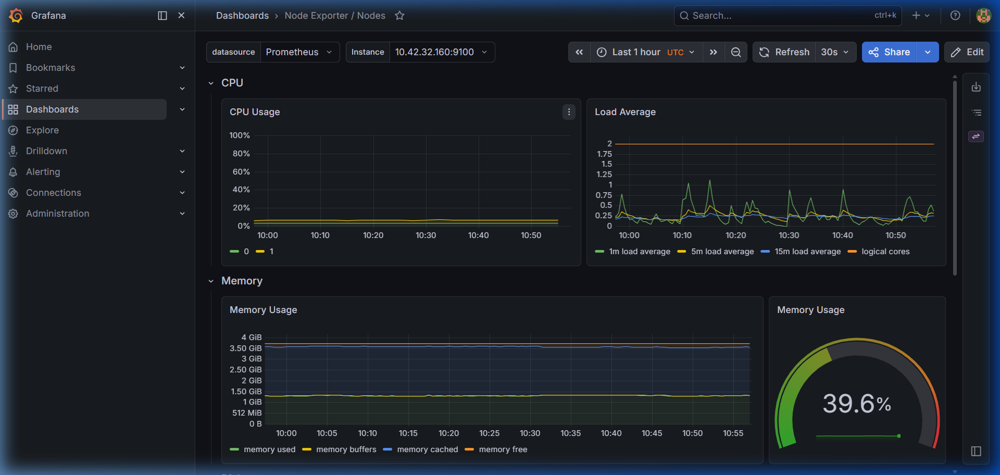
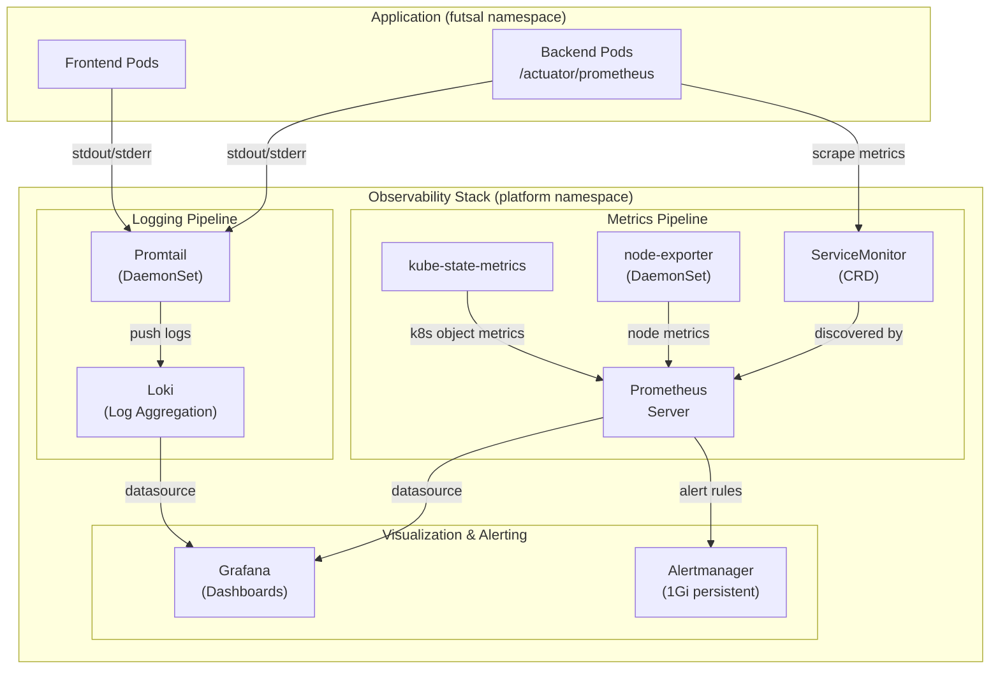
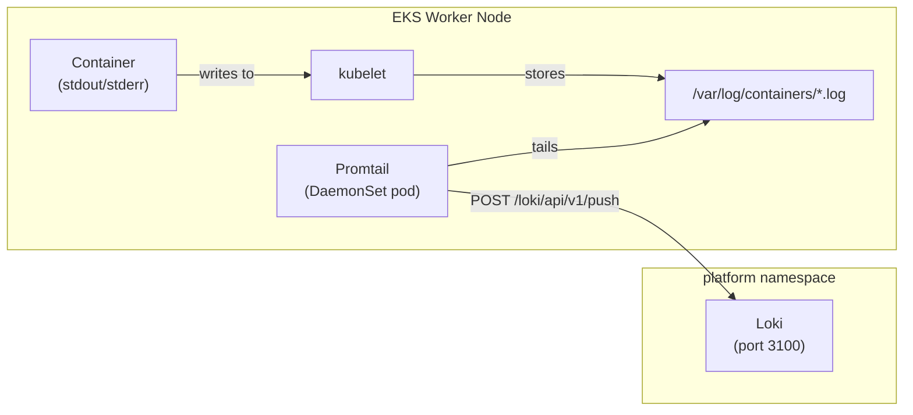
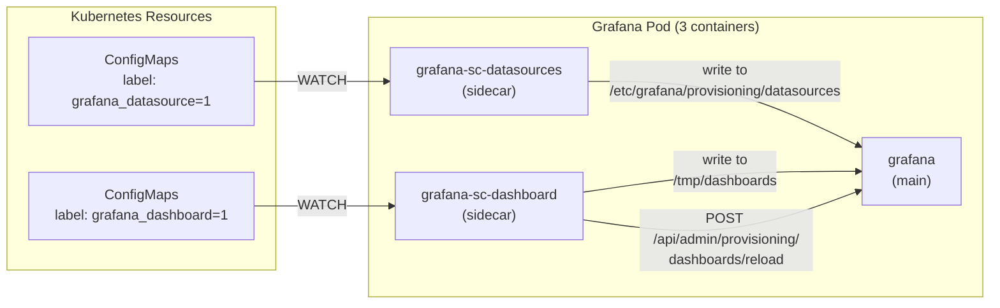
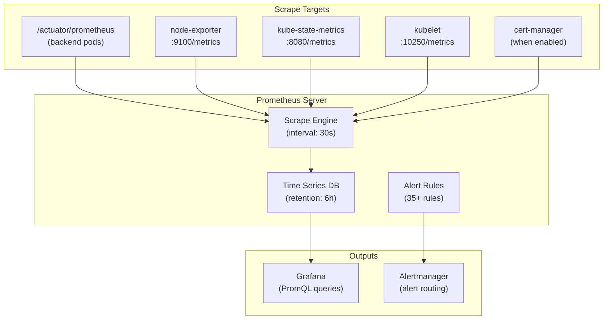

# Observability Stack

> Metrics, logging, dashboarding, and alerting infrastructure for the Futsal Booking System.

---

## Live Dashboard Screenshots

### Grafana — Kubernetes Cluster Resources

Real-time cluster-wide CPU, memory, and namespace-level resource usage from our EKS deployment:



### Grafana — Node Exporter (Hardware Metrics)

Node-level hardware metrics including CPU usage, load average, and memory utilization across worker nodes:



---

## Observability Overview

The monitoring stack follows the three pillars of observability: **metrics**, **logs**, and **alerting** — all deployed within the `platform` namespace.



---

## Metrics Pipeline

### Components

| Component | Type | Purpose |
|-----------|------|---------|
| **Prometheus** | StatefulSet | Time-series database that scrapes and stores metrics |
| **node-exporter** | DaemonSet | Exports hardware and OS metrics from each node |
| **kube-state-metrics** | Deployment | Exports Kubernetes object state (pod status, replica counts, etc.) |
| **Prometheus Operator** | Deployment | Manages Prometheus instances and ServiceMonitor CRDs |

### Prometheus Configuration

| Parameter | Value | Rationale |
|-----------|-------|-----------|
| Retention | `6h` | Short retention for sandbox (saves storage costs) |
| Storage | `emptyDir` | No persistent storage (acceptable for sandbox) |
| ServiceMonitor discovery | `serviceMonitorSelectorNilUsesHelmValues: false` | Discover ServiceMonitors across **all** namespaces |

### Application Metrics (Spring Boot)

The backend exposes Prometheus-compatible metrics via Spring Boot Actuator and Micrometer:

```
GET /actuator/prometheus
```

This endpoint exports:

| Metric Category | Examples |
|----------------|---------|
| JVM | `jvm_memory_used_bytes`, `jvm_gc_pause_seconds`, `jvm_threads_current` |
| HTTP | `http_server_requests_seconds_count`, `http_server_requests_seconds_sum` |
| HikariCP | `hikaricp_connections_active`, `hikaricp_connections_idle` |
| System | `system_cpu_usage`, `process_uptime_seconds` |
| Tomcat | `tomcat_sessions_active_current`, `tomcat_threads_current` |

### ServiceMonitor

The `ServiceMonitor` CRD tells Prometheus how to scrape the backend:

```yaml
apiVersion: monitoring.coreos.com/v1
kind: ServiceMonitor
metadata:
  name: backend
  namespace: futsal
spec:
  selector:
    matchLabels:
      app.kubernetes.io/name: backend    # Target the backend Service
  namespaceSelector:
    matchNames: [futsal]                  # Look in futsal namespace
  endpoints:
    - port: http                          # Named port on the Service
      path: /actuator/prometheus          # Metrics endpoint
      interval: 30s                       # Scrape every 30 seconds
```

This is a **declarative** scrape configuration — no manual Prometheus config editing required. When the ServiceMonitor is created, the Prometheus Operator automatically reloads Prometheus to include it.

---

## Logging Pipeline

### Components

| Component | Type | Purpose |
|-----------|------|---------|
| **Loki** | StatefulSet | Log aggregation engine (like Prometheus, but for logs) |
| **Promtail** | DaemonSet | Log shipper that runs on every node and tails container logs |

### How It Works



### Loki Configuration

| Parameter | Value | Rationale |
|-----------|-------|-----------|
| Persistence | Disabled | Logs are ephemeral in sandbox |
| Mode | Single-binary | Simple deployment for low-volume workloads |

Promtail automatically labels each log entry with Kubernetes metadata:

```
{namespace="futsal", pod="backend-685dd4f9b-8mgpj", container="backend"}
```

This enables powerful queries in Grafana like:

```
{namespace="futsal", container="backend"} |= "ERROR"
```

---

## Grafana Dashboards

### Architecture

Grafana uses the **sidecar pattern** for dashboard and datasource provisioning:



### Sidecar Containers

| Container | Purpose | Watch Label |
|-----------|---------|-------------|
| `grafana-sc-datasources` | Auto-provisions data sources from ConfigMaps | `grafana_datasource=1` |
| `grafana-sc-dashboard` | Auto-provisions dashboards from ConfigMaps | `grafana_dashboard=1` |
| `grafana` | Main Grafana application | — |

### Pre-installed Dashboards

The kube-prometheus-stack ships with 20+ pre-built dashboards:

| Dashboard | What It Shows |
|-----------|--------------|
| Kubernetes / Compute Resources / Cluster | Cluster-wide CPU, memory, network |
| Kubernetes / Compute Resources / Namespace | Per-namespace resource usage |
| Kubernetes / Compute Resources / Pod | Individual pod metrics |
| Kubernetes / Compute Resources / Workload | Deployment/StatefulSet metrics |
| Node Exporter / Nodes | Node hardware metrics (CPU, disk, network) |
| CoreDNS | DNS query rates, latency, errors |
| Prometheus | Prometheus server self-metrics |
| Alertmanager | Alert routing and notification status |

### Data Sources

Two data sources are auto-provisioned:

| Data Source | Type | URL | Default |
|-------------|------|-----|---------|
| Prometheus | `prometheus` | `http://platform-kube-prometheus-s-prometheus.platform:9090/` | ✅ Yes |
| Loki | `loki` | `http://platform-loki:3100` | No |

### Grafana Authentication

Admin credentials are sourced from AWS Secrets Manager via External Secrets:

```
AWS Secrets Manager: /futsal/sandbox/grafana
  → ExternalSecret: grafana-admin
    → Secret keys: admin-user, admin-password
      → Grafana env: GF_SECURITY_ADMIN_USER, GF_SECURITY_ADMIN_PASSWORD
```

---

## Alerting

### Alertmanager

| Parameter | Value |
|-----------|-------|
| Enabled | Yes |
| Persistent Storage | 1Gi EBS gp2 |
| Storage Class | `gp2` |

Alertmanager receives alerts from Prometheus rules and routes them to notification channels. The persistent storage ensures alert state (silences, inhibitions) survives pod restarts.

### Built-in Alert Rules

The kube-prometheus-stack installs 35+ PrometheusRule resources covering:

| Category | Example Alerts |
|----------|---------------|
| Node | `NodeFilesystemAlmostOutOfSpace`, `NodeHighCpuLoad` |
| Pod | `KubePodCrashLooping`, `KubePodNotReady` |
| Deployment | `KubeDeploymentReplicasMismatch` |
| Prometheus | `PrometheusTSDBCompactionsFailing` |
| etcd | `etcdHighCommitDurations` |

---

## Metrics Collection Architecture



---

## Key Design Decisions

| Decision | Choice | Rationale |
|----------|--------|-----------|
| Prometheus retention | 6 hours | Sandbox: minimize storage costs, sufficient for debugging |
| Prometheus storage | emptyDir | No persistent data needed for short-lived sandbox |
| Alertmanager storage | 1Gi gp2 PVC | Alert state should survive restarts |
| Loki persistence | Disabled | Logs are ephemeral for sandbox workloads |
| Dashboard provisioning | Sidecar pattern | GitOps-friendly, no manual UI configuration |
| Datasource conflict fix | Loki `isDefault: false` | Only one default datasource allowed per Grafana org |
| ServiceMonitor namespace | All namespaces | `serviceMonitorSelectorNilUsesHelmValues: false` |
| Standalone install | kube-prometheus-stack | Avoid CRD lifecycle conflicts with umbrella chart |
