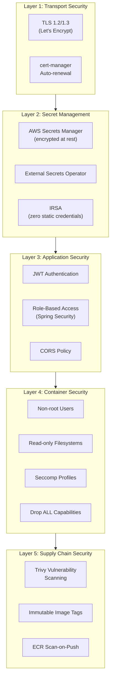
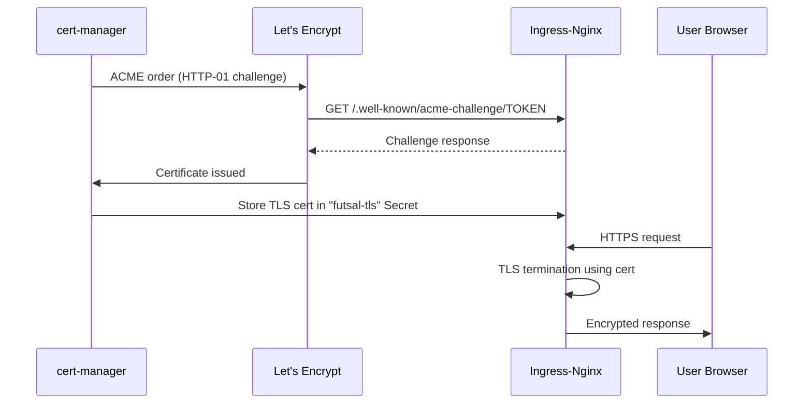
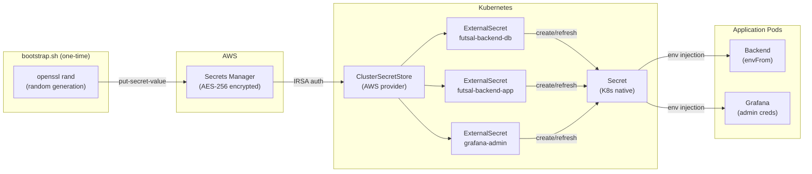
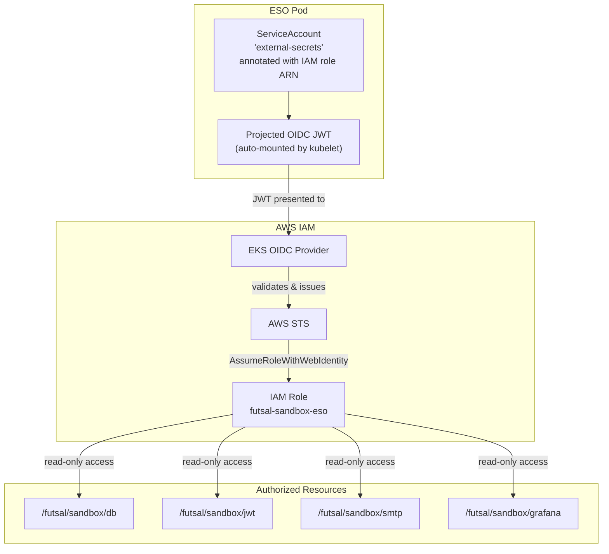

# Security Architecture

> Defense-in-depth security design spanning transport, secrets, containers, and IAM.

---

## Security Layers Overview



---

## 1. Transport Security (TLS)

All traffic to the application is encrypted via TLS certificates issued by Let's Encrypt and managed automatically by cert-manager.

### Certificate Lifecycle



### Configuration

Two `ClusterIssuer` resources are created:

| Issuer | ACME Server | Purpose |
|--------|-------------|---------|
| `letsencrypt-staging` | Staging v2 API | Testing without rate limits |
| `letsencrypt-prod` | Production v2 API | Real certificates for deployment |

The Ingress annotation `cert-manager.io/cluster-issuer: letsencrypt-prod` triggers automatic certificate provisioning and renewal:

```yaml
# Ingress annotation
cert-manager.io/cluster-issuer: "letsencrypt-prod"

# TLS configuration
spec:
  tls:
    - hosts: ["futsal-x-x-x-x.nip.io"]
      secretName: futsal-tls    # cert-manager auto-populates this
```

---

## 2. Secret Management

### Zero Secrets in Git

No credentials, passwords, or keys exist in source code or Helm values. All secrets flow through a secure chain:



### Secret Mapping

| AWS Secret Path | Kubernetes Secret | Keys | Consumer |
|----------------|-------------------|------|----------|
| `/futsal/sandbox/db` | `futsal-backend-db` | `SPRING_DATASOURCE_USERNAME`, `SPRING_DATASOURCE_PASSWORD` | Backend + PostgreSQL |
| `/futsal/sandbox/jwt` | `futsal-backend-app` | `JWT_SECRET` | Backend |
| `/futsal/sandbox/smtp` | `futsal-backend-app` | `MAIL_HOST`, `MAIL_PORT`, `MAIL_USERNAME`, `MAIL_PASSWORD` | Backend |
| `/futsal/sandbox/grafana` | `grafana-admin` | `admin-user`, `admin-password` | Grafana |

### Refresh Policy

All `ExternalSecret` resources have `refreshInterval: 1h`, meaning Kubernetes secrets are re-synced from AWS Secrets Manager every hour. If a secret is rotated in AWS, it propagates to pods within 60 minutes (or immediately on pod restart).

---

## 3. IAM & IRSA (Zero Static Credentials)

The External Secrets Operator authenticates to AWS without any static access keys. Instead, it uses IRSA (IAM Roles for Service Accounts):



### Trust Boundary

The IAM trust policy constrains role assumption to:

| Condition | Value |
|-----------|-------|
| Subject | `system:serviceaccount:platform:external-secrets` |
| Audience | `sts.amazonaws.com` |

This means only the specific ESO pod's service account can use this role — even other pods in the same namespace cannot.

### Least Privilege

The attached policy grants only **3 read-only actions** on **4 specific secret ARNs**:

```
secretsmanager:GetSecretValue
secretsmanager:DescribeSecret
secretsmanager:ListSecretVersionIds
```

No write, delete, or list-all-secrets permissions are granted.

---

## 4. Container Security

Every container in the deployment is hardened with multiple security controls:

### Backend Pod Security Context

```yaml
spec:
  securityContext:
    runAsNonRoot: true           # 1. Never run as root
    runAsUser: 1000              # 2. Explicit non-root UID
    fsGroup: 1000                # 3. File ownership for volumes
    seccompProfile:
      type: RuntimeDefault       # 4. Restrict syscalls
  containers:
    - securityContext:
        allowPrivilegeEscalation: false  # 5. No privilege escalation
        readOnlyRootFilesystem: false    # 6. Writable (for uploads)
        capabilities:
          drop: ["ALL"]                   # 7. Drop ALL Linux capabilities
```

### Frontend Pod Security Context

```yaml
spec:
  securityContext:
    runAsNonRoot: true
    runAsUser: 101               # nginx user
    fsGroup: 101
    seccompProfile:
      type: RuntimeDefault
  containers:
    - securityContext:
        allowPrivilegeEscalation: false
        readOnlyRootFilesystem: true     # Fully read-only
        capabilities:
          drop: ["ALL"]
      volumeMounts:                      # tmpfs for nginx runtime
        - name: cache
          mountPath: /var/cache/nginx
        - name: run
          mountPath: /var/run
        - name: tmp
          mountPath: /tmp
```

### Security Controls Summary

| Control | Backend | Frontend | Purpose |
|---------|---------|----------|---------|
| Non-root user | UID 1000 | UID 101 | Prevent root exploits |
| Seccomp RuntimeDefault | ✅ | ✅ | Restrict dangerous syscalls |
| Drop ALL capabilities | ✅ | ✅ | No special Linux privileges |
| No privilege escalation | ✅ | ✅ | Prevent `setuid` attacks |
| Read-only rootfs | ❌ (uploads) | ✅ | Prevent filesystem tampering |
| Resource limits | 1 CPU / 2Gi | 200m / 128Mi | Prevent resource exhaustion |

---

## 5. Availability & Resilience

### Pod Disruption Budget

```yaml
apiVersion: policy/v1
kind: PodDisruptionBudget
metadata:
  name: backend
spec:
  minAvailable: 1
```

During voluntary disruptions (node drain, cluster upgrade), Kubernetes guarantees **at least 1 backend pod remains running** at all times.

### Horizontal Pod Autoscaler

```yaml
apiVersion: autoscaling/v2
kind: HorizontalPodAutoscaler
spec:
  minReplicas: 2
  maxReplicas: 4
  metrics:
    - type: Resource
      resource:
        name: cpu
        target:
          type: Utilization
          averageUtilization: 70
```

---

## 6. Supply Chain Security

### CI Pipeline Security

| Stage | Tool | What It Does |
|-------|------|--------------|
| Build | Docker Buildx | Multi-stage builds with minimal runtime images |
| Scan | Trivy (Aqua Security) | Scans for CRITICAL and HIGH CVEs |
| Report | GitHub Code Scanning | SARIF upload to GitHub Security tab |
| Registry | GHCR | Token-based push via `GITHUB_TOKEN` |
| Image Tags | Git SHA | Immutable, traceable to exact commit |

### ECR Security

| Feature | Configuration |
|---------|--------------|
| Tag immutability | `IMMUTABLE` — prevents tag overwriting |
| Scan on push | Enabled — AWS-native vulnerability scanning |
| Encryption | AES-256 (AWS-managed key) |
| Lifecycle policy | Keep 10 most recent images |

### Image Build Hardening

The backend Dockerfile uses security best practices:

```dockerfile
# Minimal runtime image (Alpine-based JRE)
FROM eclipse-temurin:17-jre-alpine AS runtime

# Dedicated non-root user
RUN addgroup -S app && adduser -S -G app app

# Application files owned by non-root user
RUN chown -R app:app /app
USER app

# JVM container-aware memory settings
ENTRYPOINT ["java", "-XX:+UseContainerSupport", "-XX:MaxRAMPercentage=75.0", "-jar", "/app/app.jar"]
```

---

## 7. Network Security

| Layer | Configuration | Purpose |
|-------|---------------|---------|
| VPC private subnets | EKS nodes in `10.42.32.0/20`, `10.42.48.0/20` | No direct internet access to nodes |
| NAT Gateway | Outbound only via single NAT | Nodes can pull images but aren't reachable |
| NLB | Internet-facing in public subnets | Single controlled entry point |
| Ingress-Nginx | TLS termination + path-based routing | Application-layer firewall |
| Kubernetes Services | ClusterIP (internal only) | Services not directly exposed |

### Ingress Body Size Limit

```yaml
annotations:
  nginx.ingress.kubernetes.io/proxy-body-size: "10m"
```

Limits request body size to 10MB, protecting against large payload attacks while allowing file uploads.
